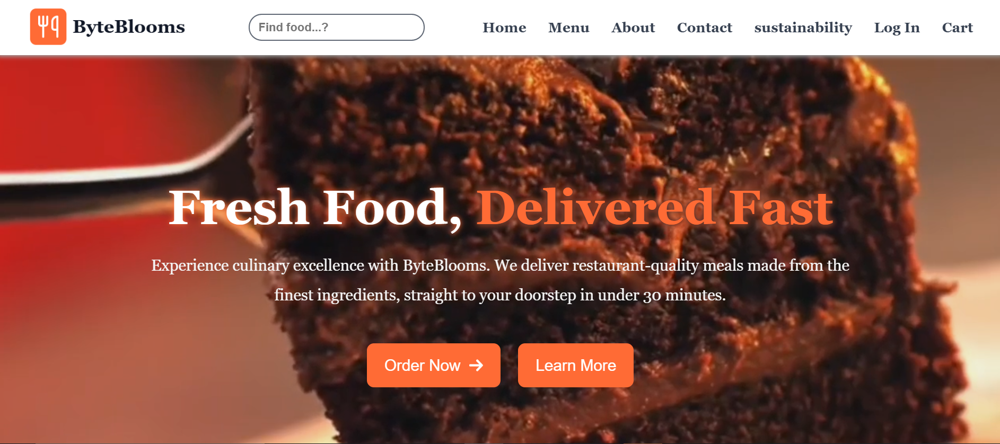
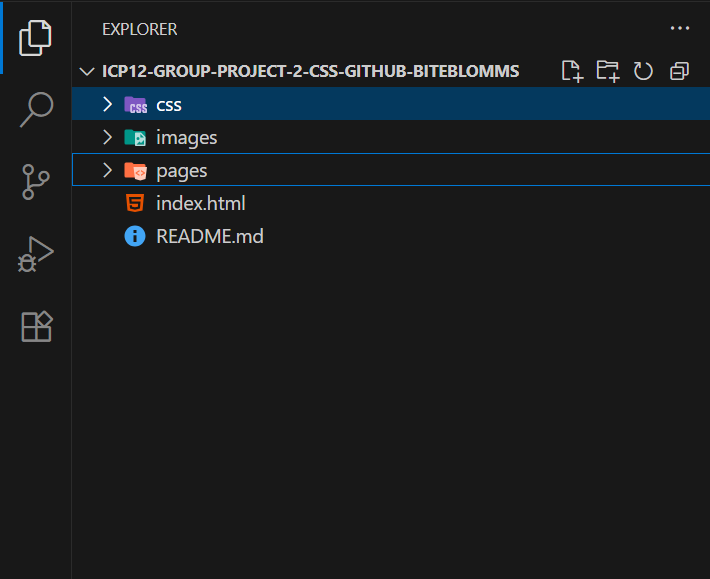

# ByteBlooms

**ByteBlooms** is a modern food delivery website that also represents an offline hotel/restaurant located in Pune. It allows customers to:
- Browse a rich food menu
- Order food online for delivery
- Explore the restaurant's offline services
- View sustainability efforts and contact info

 ## 👉 Live Website: 
https://byteblooms.netlify.app/

## 🖼️ Homepage Screenshot

---

## 🚀 Features
- Online ordering + offline restaurant details
- Mobile-friendly with hamburger menu
- Search bars (desktop + mobile)
- Background video on the homepage
- Customer favorites section with ratings and prices
- About, Contact, and Sustainability pages
 
## 💻 Tech Stack
- HTML5
- CSS3

## 📂 Folder Structure

## 🔗 Deployment
Can be deployed on
- GitHub Pages
- Netlify
- Vercel.

## ⚙️ How to Run This Website  

### ▶️ Run Locally
1️⃣ **Clone or download the repository**

git clone https://github.com/siddhikharde/icp12-group-project-2-css-github-biteblomms.git
cd byteblooms  
2️⃣ **Open index.html in your browser.**

## Contributors

